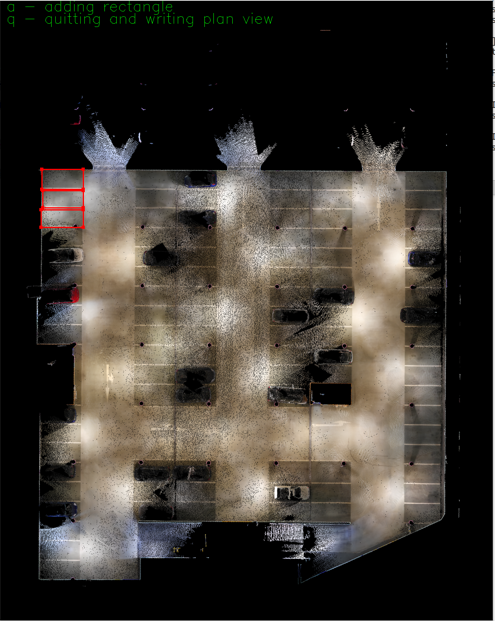
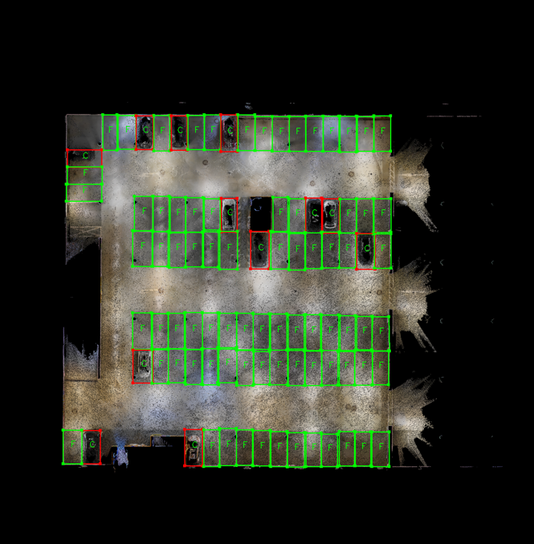

# RGBD Parking Finder
RGBD Parking Finder (PF) is a tool for annotating and recognizing free parking bays given an RGBD Point cloud.
It is easy to extend, because it has a modular architecture.

## Requirements

PF requires the following packeges to build:

* OpenCV (>= 3.0)
* Boost
* PCL (>= 1.7)
* Eigen

## How to build

PF works under Linux (tested on Ubuntu 16.04) environment. We recommend a so-called out of source build 
which can be achieved by the following command sequence:

* mkdir build
* cd build
* cmake ../
* make -j <number-of-cores+1>

## How to use

The building phase creates three executables inside the _bin_ folder.

* planimetry
* parking_training
* bay_detector

### planimetry 

It creates a plan view of the point cloud as well as the selection of the parking bays.

Usage:
```bash
$ ./planimetry /path/to/point/cloud/pointcloud.ply
```

Select the first bay with the mouse (if the bay is not a rectangle, you can also adapt the drawed rectangle to the bay by moving the corners), 
then for adding the bay to the planimetry, you have to press 'a'. Once you finish to add the bays, you have to push 'q' for quitting and saving
the planimetry.
Ater the process, three files are created: 

1. plane_view.png is the plan view image of the point cloud;
2. matrices.txt contains the rotation and the homography matrices;
3. planimetry contains the planimetry coordinates.

<p align="center">

</p>
<br>

### parking_training 

It trains a classifier given a planimetry of the cloud to train.

Usage:
```bash
$ ./parking_training /path/to/config/file/config.cfg
```
The config file contains the following lines:

```bash
[MODE] #read/compute 
compute

[CLASSIFIER] #adaboost/svm
adaboost

[VALIDATION_PERCENTAGE]
0.25

[CLASSIFIER_FILE_SAVE]
adaboost_classifier_fpfh.xml

[FEATURES_FILE]
../data_files/PointCloud_Inglostadt_Theater_10mm/Inglostadt_Theater_10mm_features_FPFH.txt

[FEATURES_TYPE] #ESF,FPFH,PFH,VFH,ESF+PHF,ESF+FPHF
FPFH

[POINT_CLOUD]
../data/PointCloud_Inglostadt_Theater_10mm/pointcloud.ply

[PLANIMETRY_FILE]
../data_files/PointCloud_Inglostadt_Theater_10mm/planimetry.txt

[PLANIMETRY_IMAGE]
../data_files/PointCloud_Inglostadt_Theater_10mm/plane_view.png

[TRANSFORMATION_FILE]
../data_files/PointCloud_Inglostadt_Theater_10mm/matrices.txt
```
Where:

* [MODE]: _read_ for reading the feature file specified in [FEATURE FILE], _compute_ for computing the features;
* [CLASSIFIER]: _svm_ for choosing the support vector machine classifier, _adaboost_ for the adaboost classifier;
* [VALIDATION_PERCENTAGE]: the value represents the percentage of the training set used for validating the classifier;
* [CLASSIFIER_FILE_SAVE]: path and name of the file for saving the classifer;
* [FEATURES_FILE]: contains the path for saving the features (it is used both for reading and writing the features);
* [FEATURE_TYPE]: contains the name of the features that you want to use: ESF,FPFH,PFH,VFH,ESF+PHF,ESF+FPHF;
* [POINT_CLOUD]: path to the point cloud to label or to classify;
* [PLANIMETRY_FILE]: path to the planimetry file of the point cloud to label;
* [PLANIMETRY_IMAGE]: path to the planimetry image of the point cloud to label;
* [TRANSFORMATION_FILE]: path to the file which contains the rotation and homography matrices of the point cloud to label.

For selecting the free and the occupied bays, you have to use the buttons _f_ for free and _c_ for occupied.
You select the rectangles by using the mouse and then you push one of the above buttons for labeling it.

The output of parking_training is:

* read mode: the classifier file specified in [CLASSIFIER_FILE_SAVE];
* compute mode: the classifier file specified in [CLASSIFIER_FILE_SAVE] and the feature file specified in [FEATURES_FILE].

Moreover, at the end of the process you obtain the error number and the accuracy of the classifier based on the validation set.

### bay_detector

It detects the free bay in a new point cloud.

Usage:
```bash
$ ./bay_detector /path/to/config/file/config.cfg
```

The config file contains the following lines:

```bash
[CLASSIFIER] #adaboost/svm
adaboost

[CLASSIFIER_FILE_SAVE]
../data_files/PointCloud_Inglostadt_Theater_10mm/adaboost_classifier_esf.xml

[FEATURES_TYPE] #ESF,FPFH,PFH,VFH,ESF+PHF,ESF+FPHF
ESF

[POINT_CLOUD]
../data/PointCloud_Inglostadt_Theater2_10mm/pointcloud.ply

[PLANIMETRY_FILE]
../data_files/PointCloud_Inglostadt_Theater2_10mm/planimetry.txt

[PLANIMETRY_IMAGE]
../data_files/PointCloud_Inglostadt_Theater2_10mm/plane_view.png

[TRANSFORMATION_FILE]
../data_files/PointCloud_Inglostadt_Theater2_10mm/matrices.txt
```
Where:

* [CLASSIFIER]: _svm_ for choosing the support vector machine classifier, _adaboost_ for the adaboost classifier;
* [CLASSIFIER_FILE_SAVE]: path and name of the file where the classifer is saved;
* [FEATURE_TYPE]: contains the name of the features that you want to use: ESF,FPFH,PFH,VFH,ESF+PHF,ESF+FPHF;
* [POINT_CLOUD]: path to the point cloud to classify;
* [PLANIMETRY_FILE]: path to the planimetry file of the point cloud to classify;
* [PLANIMETRY_IMAGE]: path to the planimetry image of the point cloud to classify;
* [TRANSFORMATION_FILE]: path to the file which contains the rotation and homography matrices of the point cloud to classify.

The output is an image with the classified bays.

<p align="center">

</p>
<br>

##RESULTS

Inside the folders *data_files/point_cloud_1/results* and *data_files/point_cloud_2/results* you can find the results of the classification. 
Two point clouds are available by following these links:
* [Point Cloud 1](https://goo.gl/cFKsk9)
* [Point Cloud 2](https://goo.gl/XfrwZe)
